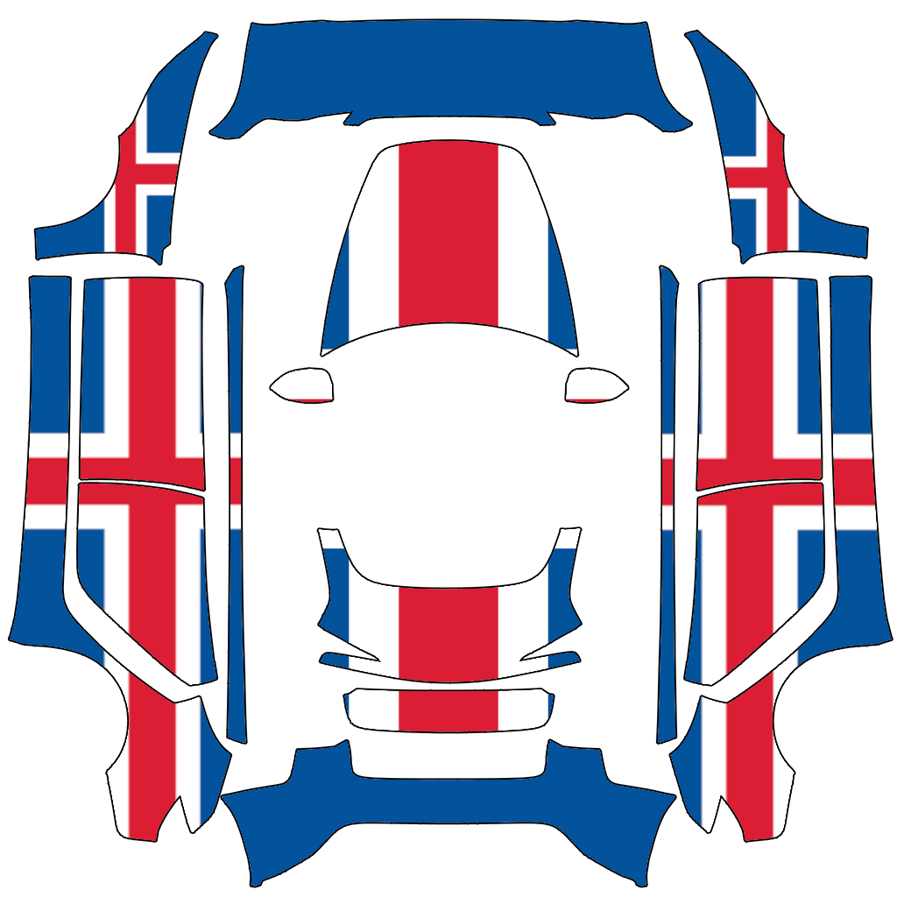
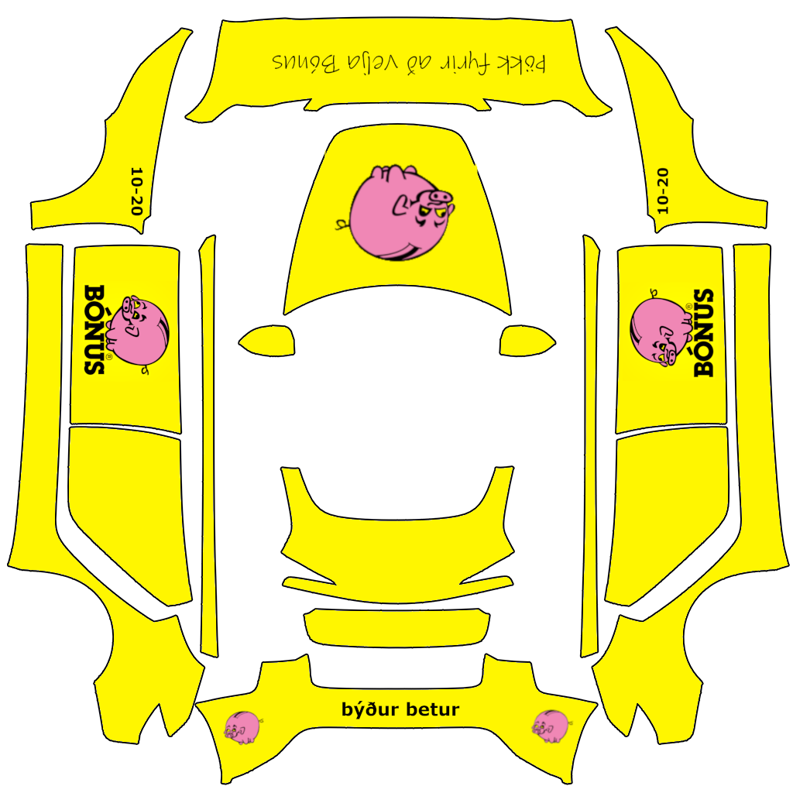

# Icelandic Custom Wraps Collection

A comprehensive collection of custom Tesla vehicle wrap designs with Iceland-themed graphics and templates for creating your own custom wraps.

## Overview

This repository provides ready-to-use wrap designs and design templates for various Tesla models. The collection includes Iceland-specific themed wraps (Iceland flag, Icelandic companies) as well as base templates and examples for creating custom designs.

## Supported Tesla Models

- **Model 3** (standard and 2024+ base/performance)
- **Model Y** (standard, Long Range, and 2025+ base/performance/premium)
- **Cybertruck**

## Repository Structure

Each model folder contains:
- `template.png` - Base template for creating custom wraps
- `vehicle_image.png` - Reference image of the vehicle
- `example/` - Directory with example wrap designs
- `README.md` - Model-specific instructions

## Iceland-Themed Wraps

### Model 3 (2024+) Base
Location: `./model3-2024-base/iceland/`

#### General Designs
* **Iceland Flag** (`iceland_flag.png`)
   
  

#### Company Wraps (`/fyrirtæki/`)
* **Bónus** (`/bónus/bonus.png`) - Icelandic supermarket chain wrap
   
  

#### Design Templates
* **GIMP Templates** (`/gimp template/`) - For GIMP image editing software
* **Inkscape Templates** (`/inpspace template/`) - For Inkscape vector graphics

## How to Use

1. **Select your wrap**: Browse the appropriate folder for your Tesla model
2. **Choose a design**: Pick from Iceland-themed wraps or example designs
3. **Prepare USB drive**: Copy the desired PNG files to a USB drive
4. **Create Wraps folder**: Place the files in a folder named `Wraps` on the USB drive
5. **Apply to vehicle**: Use your Tesla's customization menu to apply the wrap

## Creating Custom Wraps

Each model folder contains:
- **Template PNG**: Use as a base for your custom design
- **Vehicle Image**: Reference for alignment and proportions

You can create custom wraps using:
- GIMP (templates provided in `model3-2024-base/iceland/gimp template/`)
- Inkscape (templates provided in `model3-2024-base/iceland/inpspace template/`)
- Any image editing software that supports PNG format

## Contributing

To add new Iceland-themed wraps:
1. Create your design using the appropriate model template
2. Export as PNG at the correct dimensions
3. Follow the existing folder structure
4. Add preview images to the README

## License

Custom wrap designs for Tesla vehicles. Please respect Tesla's terms of service when using custom wraps.